# **School_District_Analysis**

## **Overview of the school district analysis**
The purpose of the project is analyse the following data of the High Schools before and after a possible academic dishonesty, where the data for 9th Grade of Thomas High School has been upheld for the analysis purpose. We have replaced the math and reading scores for Thomas High School with NaNs while keeping the rest of the data intact. We will analyse the data before and after making this change.
* The district summary.
* The school summary.
* The top 5 and bottom 5 performing schools, based on the overall passing rate.
* The average math score for each grade level from each school.
* The average reading score for each grade level from each school.
* The scores by school spending per student, by school size, and by school type.

## **Results**
### The district summary analysis:	
District_Summary_Before
****
District_Summary_After
**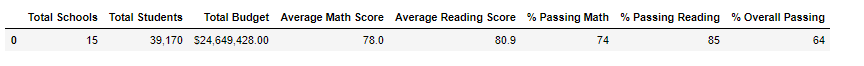**

* The data remains unaffected in terms of Total Schools, Total Students and Total Budget. 
* Average math and reading scores dropped just by 1%, i.e. from 79% to 78% and 81.9% to 80.9% respectively.
* % Passing Math, % Passing Reading and % Overall passing also showed 1% drop after the change from 75% to 74%, 86% to 85% and 65% to 64% respectively.

### The School summary analysis:
Per_School_Summary_Before
**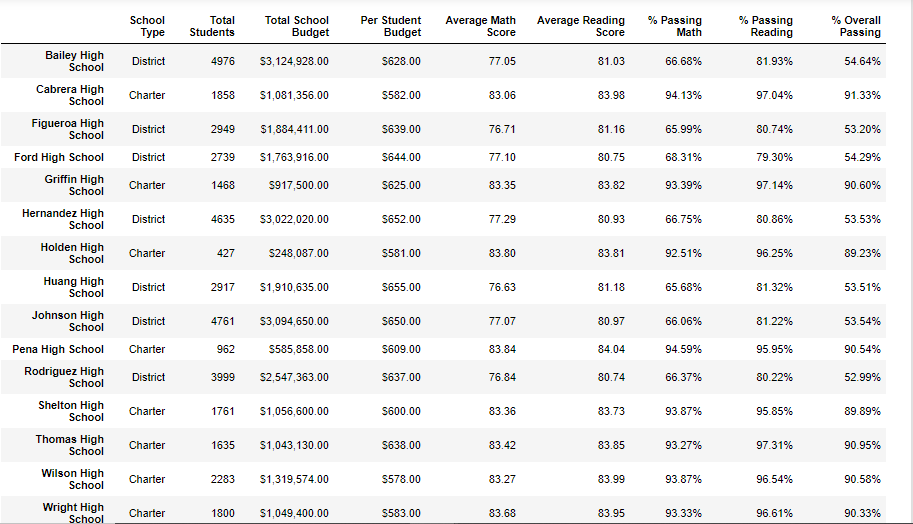**
Per_School_Summary_After
**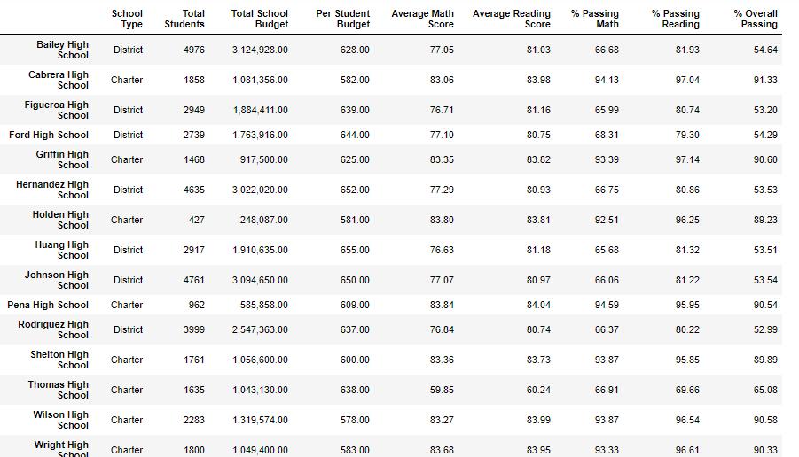**

* The data remains unaffected for all schools except for Thomas High School which showed a drasctic drop in all grade parameters and passing %.
* Average Math Score and Average Reading scores for Thomas High School changed drastically from 83.42 to 59.85 and 83.85 to 60.24 respectively after the change of Data.
* % Passing Students for Math and Reading for Thomas High School came considerable down from 93.27% to 66.91% and 97.31% to 69.66% respectively.
* % Overall passing students for Thomas High School came down from 90.95% to 65.08%.

### Replacing the ninth graders’ math and reading scores affected Thomas High School’s performance drastically when compared to other schools.
* Average Math Score and Average Reading scores dropped to 23-25.
* % Passing Students for Math and Reading dropped to almost 27%.
* % Overall passing students dropped to almost 25%.

### Replacing the ninth-grade scores affect the following:
* Math and reading scores by grade:

Average_Math_Score_By_Grade_Before
**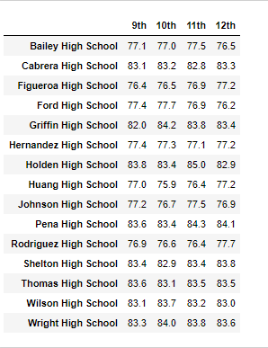**

Average_Math_Score_By_Grade_After
**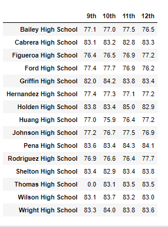**

Average_Reading_Score_By_Grade_Before
**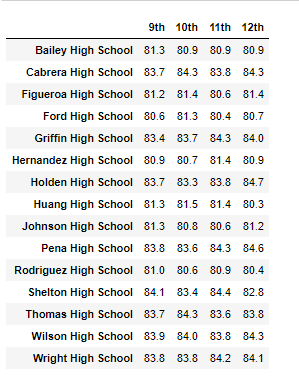**

Average_Raading_Score_By_Grade_After
**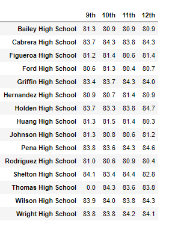**

* The average math and reading scores of Thomas High School bacame 0 from 83.6 and 83.7 respectively.
* The rank of Thomas High School which was 2nd on the list moved down to 8th position duw to the change.

Top5_Schools_Before
**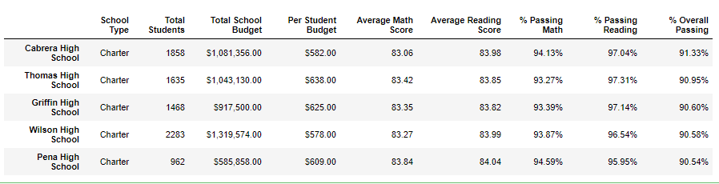** 

Top_Schools_All_After
**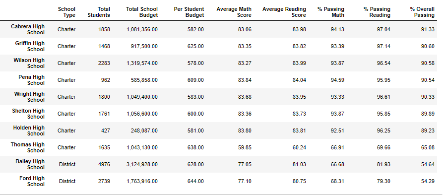** 

The bottom 5 schools remained unchanged after the change.

Bottom5_Schools_Before
**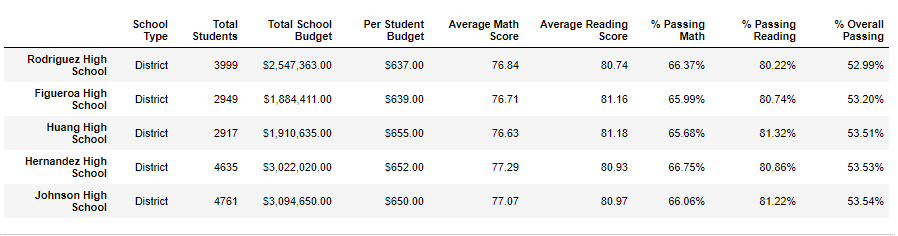** 

Bottom5_Schools_After
**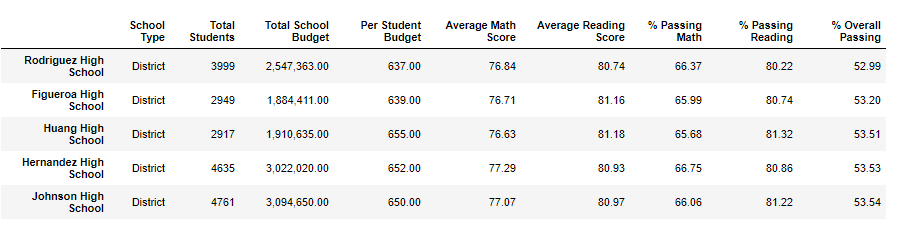** 

* Scores by school spending

Scores_By_School_Spending_Per_Student_Before
**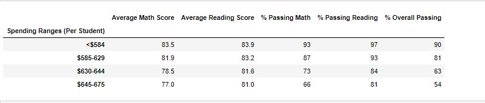**

Scores_By_School_Spending_Per_Student_After
**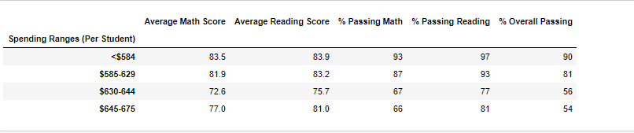**

Since Thomas High School fell in the category of spending range per student of $630- $644, 
1. Average math and reading scores dropped down from 78.5 to 72.6 and 81.6 to 75.7 respectively.
2. % passing math and reading dropped don from 73% to 67% and 84% to 77% respectively.
3. % Overall students passing dropped from 63% to 56%.
Rest data remained unaffected.

* Scores by school size
Scores_By_School_Size_Before
**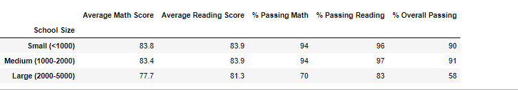**

Scores_By_School_Size_After
**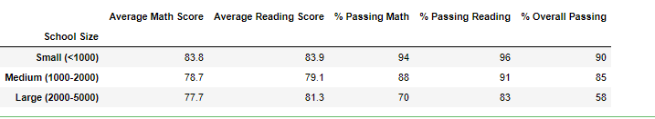**

Since Thomas High School fell in the Medium Category(1000-2000), 
1. Average math and reading scores dropped down from 83.4 to 78.7 and 83.9 to 79.1 respectively.
2. % passing math and reading dropped don from 94% to 88% and 97% to 91% respectively.
3. % Overall students passing dropped from 91% to 85%.
Rest data remained unaffected.

* Scores by school type
Scores_By_School_Type_Before
**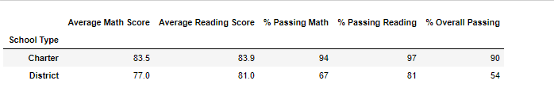**

Scores_By_School_Type_After
**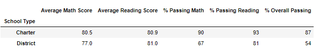**

Since Thomas High School fell in the Charter category, 
1. Average math and reading scores dropped down from 83.5 to 80.5 and 83.9 to 80.9 respectively.
2. % passing math and reading dropped don from 94% to 90% and 97% to 93% respectively.
3. % Overall students passing dropped from 90% to 87%.
Rest data remained unaffected.

## Summary
The four major changes in the updated school district analysis after reading and math scores for the ninth grade at Thomas High School have been replaced with NaNs.
* Thomas High School that was ranked 2nd dropped out of the top 5 schools right to number 8 position after the change.
* The average math and reading scores were dropped slightly at district level, but drastically at school and grade level after the change.
* The percentage passing students for math, reading and overall was also significantly affected at school and grade level for Thomas High School after the change.
* All academic parameters related to math, reading and overall score were drastically dropped which ever category of type, size and school spending per student Thomas high School fell into. 
