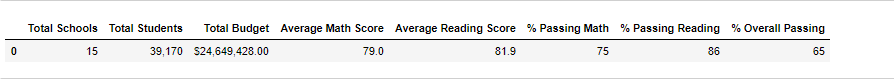

# **School_District_Analysis**

## **Overview of the school district analysis**
The purpose of the project is analyse the following data of the High Schools before and after a possible academic dishonesty, where the data for 9th Grade of Thomas High School has been upheld for the analysis purpose. We have replaced the math and reading scores for Thomas High School with NaNs while keeping the rest of the data intact. We will analyse the data before and after making this change.
* The district summary.
* The school summary.
* The top 5 and bottom 5 performing schools, based on the overall passing rate.
* The average math score for each grade level from each school.
* The average reading score for each grade level from each school.
* The scores by school spending per student, by school size, and by school type.

## **Results**
* The district summary analysis:	
******

****

i. Data remains unaffected in terms of Total Schools, Total Students and Total Budget. 
ii. Average math and reading scores slightly showed a slight change that couldn't even be caught after rounding of the value to tens.
iii. % Passing Math, % Passing Reading and & Overall passing alsoshowed a slight change that couldn't even be caught after rounding of the value to tens.

* How is the school summary affected?
i. School type, Total Students, Total School Budget and Per student budget remain unaffected.
ii. Average Math Score and Average Reading scores changed slightly from 83.42 to 83.35 and 83.85 to 83.90 for Thomas High School after the change of Data.
iii. % Passing Students for Math and Reading came considerable down for Thomas High school from 93.27% to 66.99 and 97.31% to 69.66% respectively.
iv. % Overall passing students for Thomas High School came down from 90.95% to 

* How does replacing the ninth graders’ math and reading scores affect Thomas High School’s performance relative to the other schools?
* How does replacing the ninth-grade scores affect the following:
Math and reading scores by grade
Scores by school spending
Scores by school size
Scores by school type

## Summary
Summarize four major changes in the updated school district analysis after reading and math scores for the ninth grade at Thomas High School have been replaced with NaNs.

step wise testing code is commented out for better readability. comments can be taken off to test.
certain mean values fornatted for the purpose of readability and comparison with before chnage values. in analysis and put back to unformatted if use din futuer code, causinf error, as float formating formula used for strings.
Nan values replaced by 0. 